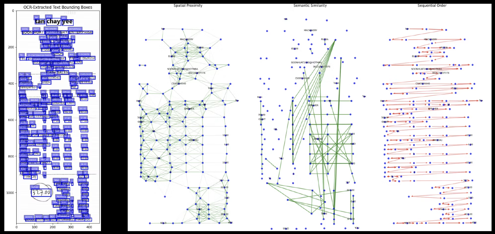

# Optical Character Recognition for Receipts

An end-to-end pipeline for extracting structured information from receipt images using deep learning and natural language processing.

## 🎯 Overview

This project implements a comprehensive receipt processing system that:
- Denoises receipt images using Restormer architecture
- Performs OCR using DocTR framework (DBNet + CRNN)
- Extracts key information using SDMGR (Spatial Dual Modality Graph Reasoning)
- Processes natural language queries and converts them to SQL using Gemini Pro LLM

## 🏗️ Final Result



### Pipeline Flow

1. **Image Denoising**: Restormer-based attention model removes noise from receipt images
2. **Text Detection & Recognition**: DocTR framework detects and extracts text regions
3. **Information Extraction**: SDMGR model identifies key-value pairs from receipts
4. **Query Processing**: Natural language queries are converted to SQL for data retrieval

## 🛠️ Technical Stack

### Deep Learning Models
- **Restormer**: Transformer-based image denoising
- **DocTR**: State-of-the-art OCR framework
- **SDMGR**: Spatial Dual Modality Graph Reasoning for KIE
- **Gemini Pro**: LLM for SQL query generation

### Frameworks & Libraries
- PyTorch
- torch-geometric
- Flask (API backend)
- SQL Alchemy
- OpenCV

## 📊 Performance Metrics

- **Denoising Performance**: MSE reduced to 0.0116 by epoch 22
- **OCR Accuracy**: 76.97% using DocTR
- **KIE F1 Score**: 93% using SDMGR
- **End-to-end Processing Time**: ~2.5 seconds per receipt

## 📁 Project Structure

```
RECEIPT-OCR/
├── Denoising restformer/      # Restormer implementation
│   ├── Restformer.py          # Main model architecture
│   ├── RestformerBlocks.py    # Building blocks
│   ├── dataset.py             # Data loading utilities
│   └── Results/               # Training visualizations
├── KIE/                       # Key Information Extraction
│   ├── model.py               # GCN model
│   ├── graph.py               # Graph construction
│   └── dataset.py             # SROIE dataset loader
├── SDMGR/                     # Spatial Dual Modality Graph Reasoning
│   ├── VisionModel.py         # Vision processing
│   ├── transformer.py         # Text processing
│   └── PreprocessingModule.py # Dual modality fusion
└── LLM/                       # Natural Language Processing
    ├── app.py                 # Flask API
    ├── gemini_functions.py    # LLM integration
    └── database_functions.py  # SQL query execution
```

## 🔬 Model Architecture Details

### Restormer
- Multi-head self-attention with depthwise convolutions
- Encoder-decoder architecture with skip connections
- 26.7M parameters, trained on document denoising dataset

### SDMGR
- Dual modality processing (vision + text)
- U-Net based vision model with attention
- Transformer encoder for text features
- Graph reasoning for spatial relationships

### KIE Module
- Graph Convolutional Network (GCN)
- Node features: text embeddings + spatial features
- Edge connections: spatial proximity
- 5 output classes: company, address, date, total, undefined

## 📈 Training Results


Training metrics show consistent improvement in denoising quality, with MSE reducing from 0.0223 to 0.0116 by epoch 22.
